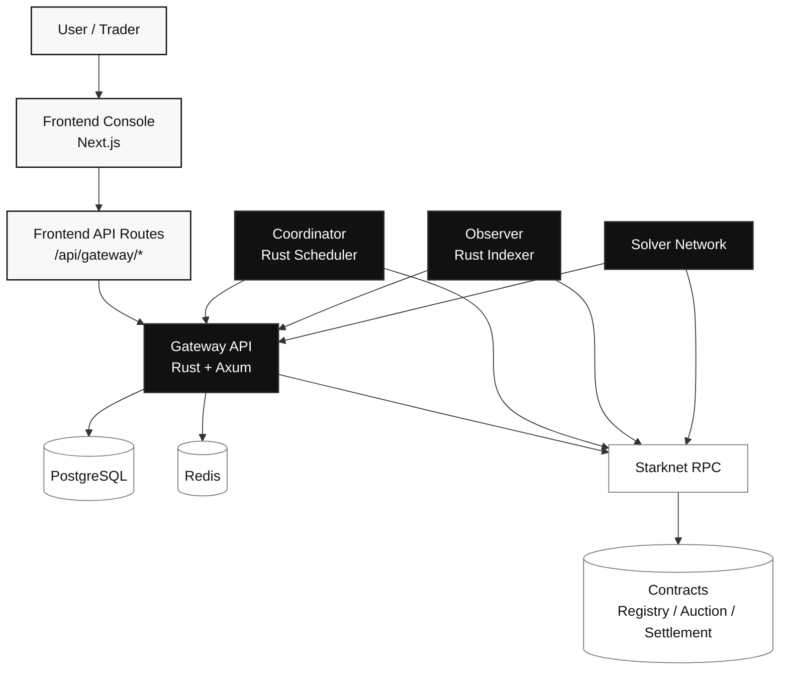
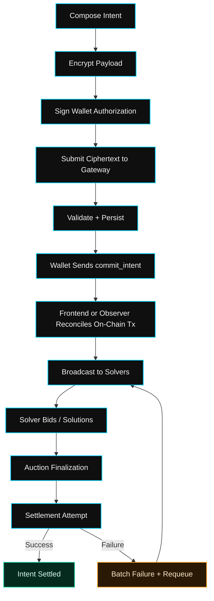
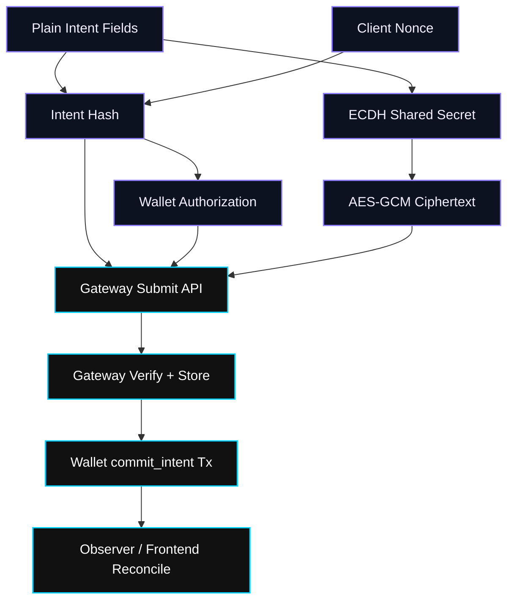
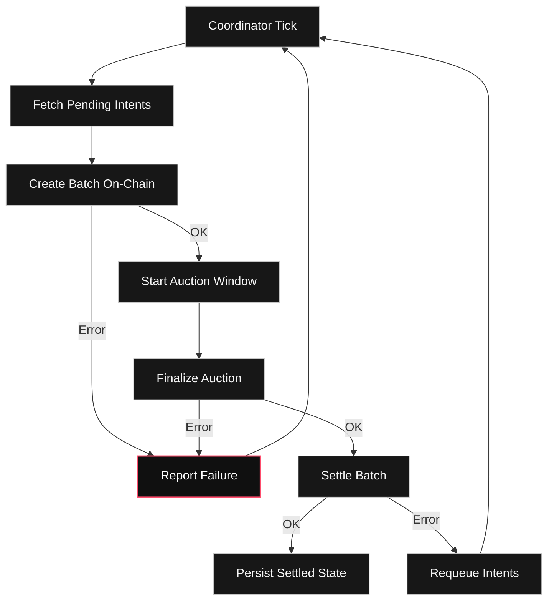

# BlindMarkets

Privacy-preserving Bitcoin intent execution with a frontend control console, gateway API, coordinator, observer, reference solver, and Starknet contracts.

## What This Repository Contains

BlindMarkets is a monorepo with:

- `frontend/`: Next.js app (App Router) for composing intents, monitoring batches, and viewing risk/analytics.
- `backend/gateway/`: Rust API that validates, decrypts, stores, and relays intents.
- `backend/coordinator/`: Rust scheduler for deterministic batching and auction finalization.
- `backend/observer/`: Rust chain indexer that reconciles settlement, failure, commit, and cancel events.
- `contracts/`: Cairo contracts for registry, auctions, settlement, and solver bonds.
- `solver-reference/`: Reference solver that subscribes to gateway broadcasts and submits solutions/settlements.
- `docs/`: requirements and archived implementation notes.

## Repository Layout

```text
blindmarkets/
├── frontend/                # Next.js UI + API proxy routes
├── backend/
│   ├── gateway/             # Rust gateway API
│   ├── coordinator/         # Rust batch scheduler
│   └── observer/            # Starknet event observer / reconciler
├── contracts/               # Starknet Cairo contracts + tests
├── solver-reference/        # Reference solver node
├── docs/
│   ├── requirements/prd.md
│   └── archive/*.md
└── scripts/                 # deployment and test helpers
```

## System Canvas



## Intent Lifecycle (Execution Timeline)



## Privacy Envelope (Client to Gateway)



## Failure and Recovery Loop



## Frontend Development

### 1) Install and run

```bash
cd frontend
npm install
npm run dev -p 3001
```

Frontend local URL: `http://localhost:3001`

### 2) Required environment variables

Use `frontend/.env.example` as the source of truth.

Server-side vars used by Next API routes:

- `GATEWAY_URL`
- `GATEWAY_API_KEY_HEADER`
- `GATEWAY_API_KEY`

Public vars used by UI:

- `NEXT_PUBLIC_BATCH_WINDOW_SECONDS`
- `NEXT_PUBLIC_GENESIS_TIMESTAMP`
- `NEXT_PUBLIC_*` risk/default display vars

## Docker Compose Stack

The repository now includes `docker-compose.yml` and per-service Dockerfiles for:

- `frontend`
- `gateway`
- `coordinator`
- `observer`
- `solver`
- `postgres`
- `redis`

Bring up the full local stack:

```bash
cp .env.compose.example .env
docker compose build
docker compose up -d
```

Default local URLs:

- Frontend: `http://127.0.0.1:3001`
- Gateway: `http://127.0.0.1:3000`
- PostgreSQL: `127.0.0.1:5432`
- Redis: `127.0.0.1:6379`

Observer-specific note:

- `OBSERVER_CONTRACT_ADDRESSES` must include every contract whose events you want indexed.
- `OBSERVER_*_EVENT_KEY` values must be set to the deployed Starknet event selectors for `BatchSettled`, `BatchFailed`, `IntentCommitted`, and `IntentCanceled`.

## Vercel Deployment (Frontend)

`frontend/vercel.json` is configured for Next.js builds.

Recommended Vercel project settings:

- Framework Preset: `Next.js`
- Root Directory: `frontend`
- Install Command: `npm install`
- Build Command: `npm run build`

Set env vars in Vercel Project Settings:

- `GATEWAY_URL`
- `GATEWAY_API_KEY_HEADER`
- `GATEWAY_API_KEY`
- Required `NEXT_PUBLIC_*` variables for display/config

## Documents and Specs

- Product requirements: `docs/requirements/prd.md`
- Historical implementation/checklist notes: `docs/archive/`

## Security Notes

- Never commit real API keys or private keys.
- Keep `.env*` files local (ignored by git).
- Use separate credentials for local, staging, and production.
